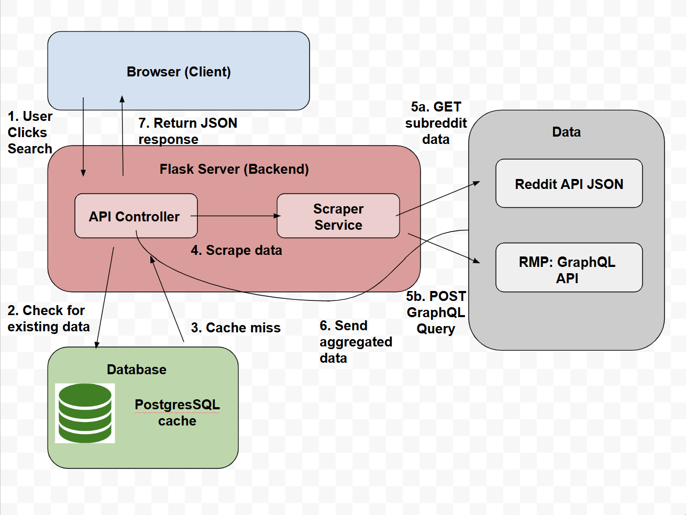

# VT CourseHelper

A web application that helps Virginia Tech students research professors and courses before registration. The application combines professor ratings from Rate My Professors with relevant discussions from r/VirginiaTech, providing both quantitative ratings and student experiences in a single search.

---

## Features

- Search professor ratings and difficulty scores from Rate My Professors
- View relevant Reddit discussions from r/VirginiaTech with direct links to each thread
- Cache search results for 7 days to reduce API requests and improve response times
- Continue serving available data even if one source is temporarily unavailable

---

## Architecture

### Stack

| Technology | Why I Used It |
|------------|---------------|
| Flask | I wanted a lightweight backend framework that let me focus on building the API without unnecessary complexity. |
| PostgreSQL | I wanted to learn how to use a SQL database. I also wanted to gain experince designing a relational schema and practice aggregating data. |
| Graph QL | I used the Rate My Professors GraphQL endpoint because it allows me to request only the professor data needed for each search, keeping API requests efficient. |


### Request Flow

1. The frontend sends a request to `GET /api/search`.
2. `InputValidator` parses the search string into a professor name, department, and course number.
3. `CacheManager` checks PostgreSQL for a matching cached result.
4. If no valid cache entry exists, `RMPScraper` and `RedditScraper` retrieve fresh data.
5. The new results are stored in the cache.
6. The API returns a combined response, which the frontend displays.

---

## Data Flow



---

## Database

The application uses a single table, `course_cache`, with one row for each `(professor_name, course_id)` combination.

| Column | Type | Purpose |
|--------|------|---------|
| `id` | Integer | Primary key |
| `professor_name` | String | Normalized professor name |
| `course_id` | String | Course identifier (e.g. `ECE 1004`) |
| `average_rating` | Float | Professor rating from Rate My Professors |
| `average_difficulty` | Float | Difficulty score from Rate My Professors |
| `reddit_posts` | Text (JSON) | Cached Reddit posts and links |
| `created_at` | DateTime | Time the cache entry was created |
| `updated_at` | DateTime | Last time the cache entry was refreshed |

A unique constraint on `(professor_name, course_id)` prevents duplicate cache entries.

Cache entries expire after seven days of inactivity. Whenever an entry is accessed, its expiration window is refreshed, allowing frequently searched courses to remain cached while older, unused entries are automatically refreshed when requested again.

---

## Running the Application

### Docker

```powershell
docker-compose up -d --build
```

The application will be available at:

```
http://localhost:5000
```

After making code changes:

```powershell
docker-compose down -v
docker-compose up -d --build
```

### Local Development

```powershell
python -m venv venv
venv\Scripts\activate
pip install -r requirements.txt
python wsgi.py
```

A PostgreSQL instance must be running, and a `.env` file must contain a valid `DATABASE_URL`.

---

## API

### `GET /api/search`

**Query Parameters**

| Parameter | Required | Description |
|----------|----------|-------------|
| `query` | Yes | Search string in the format `First Last DEPT 1234` |

Example:

```bash
curl "http://localhost:5000/api/search?query=Arthur%20Ball%20ECE%201004"
```

Response includes:

- Professor information
- Course information
- Rate My Professors ratings and difficulty
- Related Reddit discussions
- Timestamp of the search

---

### `GET /api/health`

```bash
curl "http://localhost:5000/api/health"
```

Returns the application's health status and current timestamp.